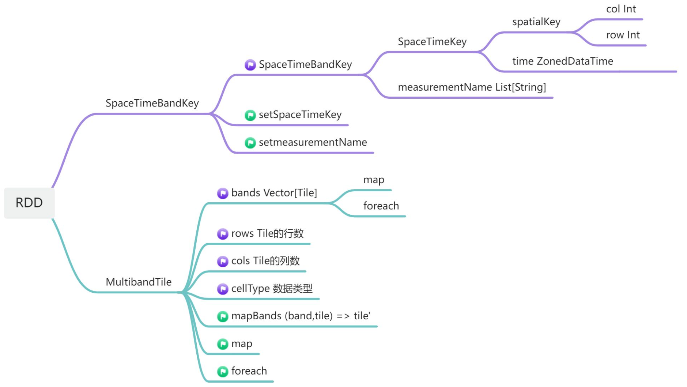
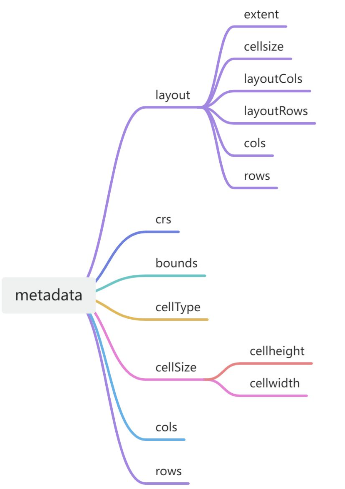

# Develop Guidance
Chiness Version can be found in https://www.openge.org.cn/docs/oge-develop-guidance.html

OGE-Computation is an OGE computational backend developed based on the Spark open-source parallel computing framework and built using the Scala language. 
It handles the computational functions within OGE's development center, including data reading, algorithm invocation, parallel data processing, and result return. 
OGE-Computation's processing is built upon Spark RDDs (Resilient Distributed Datasets). It can invoke OGE native operators developed in Scala, as well as encapsulated GRASS or QGIS operators, to process raster data, vector data, and other data types. OGE-Computation utilizes the geotrellis, gdal, colt, and jts libraries to implement raster computations, geometric computations, and other computational capabilities.

# Data Structure
The following introduces the data structures in OGE-Computation and how to build algorithms using OGE-Computation.

## Coverage Structure
In OGE-Computation, a Coverage refers to an image containing multiple bands and the original image metadata.
A Coverage consists of two parts: RDD[(SpaceTimeBandKey, MultibandTile)] and TileLayerMetadata[SpaceTimeKey], i.e., one RDD and one set of metadata. RDD[(SpaceTimeBandKey, MultibandTile)] utilizes a Map structure to manage image data via the key SpaceTimeBandKey and value MultibandTile. Each pair (SpaceTimeBandKey, MultibandTile) corresponds to a data tile within the image's spatial domain. Each slice has a fixed spatial dimension of 256 pixels × 256 pixels, and its band dimension encompasses all bands contained within the image. The SpaceTimeBandKey contains three attributes: spatialKey, time, and measurementName, representing the row/column index of the tile within the entire image, the image time, and the band name, respectively. The MultibandTile contains multiple members:

- bands Vector[Tile]: Multiple band tiles organized as a vector, forming the structure that actually records image information.
- rows: Number of pixel rows within the tile. All are 256.
- cols: Number of pixel columns within the tile. All are 256.
- cellType: Enumerated type corresponding to the pixel data type.

The RDD data structure is illustrated below:


The metadata records the image's metadata, with several key attributes including:

- layout: Records the coverage's extent, tile rows (layoutRows), tile columns (layoutCols), cell size (cellsize), and the image's rows and columns (rows, cols).
- crs: Image projection coordinate system
- cellType: Pixel data type

The metadata structure is illustrated below. Some attribute information may be redundant.



# Feature Structure

The feature format in OGE-Computation is represented as RDD[(String,(Geometry, Map[String, Any]))], where String denotes the id uniquely identifying a vector data point; Geometry represents the JTS data structure storing geometric data; and Map[String, Any] stores attribute data, with String as the attribute key and Any as the value of any data type. When a featureRDD contains only one element, it represents a single feature. When a featureRDD contains multiple elements, it represents a collection of features.

# Data Loading

Coverage and feature data can be loaded from local file system, for example:
```scala
val coverage = Coverage.loadFromLocalTiff(sc, "file:///path/to/coverage")
val file = Source.fromFile(filePath).mkString
val feature = Feature.geometry(sc, file, crs)
```

# Data Saveing

Data can be saved to local file system, for example:
```scala
Coverage.makeTIFF(coverage, coverageName, path)
Feature.saveFeatureRDDToShp(feature, outputShpPath)
BufferedWriter(new FileWriter(outputVectorPath)).write(Feature.toGeoJSONString(feature))
```
